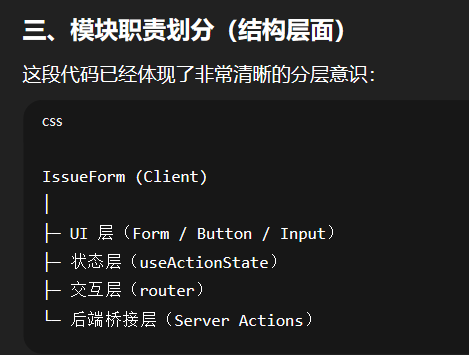
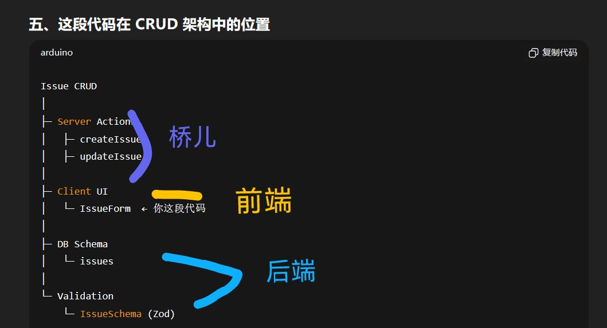

**目前是版本 1.0**

# 开发流程

- 需求冻结：version1.0 主要是背单词
- 数据库
- 后端：业务规则
- 前端

# 数据库和数据准备
- 建表：db/schema.ts 3个tables，不同表之间relation的字段类型要统一
code:
<li>npm drizzle-kit generate</li> 
<li>npm drizzle-kit migrate</li>  

- 准备数据：注意字段
- seed脚本：给数据库填充初始数据，方便开发、测试或演示
bug：db not found（可能是node和next，关于路径的规则不一致导致的）
npx tsx seed/seed.ts

**数据库知识**
pgTable：定义一张表
serial：自动递增的 id
varchar / text：字符串
integer：数字
timestamp：时间

# 后端
**AI时代淘汰的不是程序员，而是不理解自己在做什么的人**
- 业务规则表

- 数据流
I：页面展示要背的单词，用户点击“认识”，“不认识”
F: 根据用户反馈，*Function submitWordResult()* 计算新值（familiarity, count），决定更新单词进度status,nextReview和lastReviewed;管理显示单词的index
O: 更新userWordProgress表，UI显示下个要背的单词
P：要持久化persistence，userWordProgress表保存status、nextreview、lastreview

- 状态流
userWordProgress表，status4种状态：new, learning, review, mastered
new(first) > learning
learning 
> (答对5次) > review
> (wrong) > L1，L2,L3,L4,降级
review
> (答对3次) > mastered
> (wrong) > learning

**下次这里补充一个例子**
- 参数传递（沿着业务流动）
主要问题：
- 不能在client component中，import dal后端函数，需要server actions
- 数据库可以在server compo中获取words和userId，然后通过props传递给子组件（use client）
- submitWordResultAction(userId, wordId, isCorrect),传参错误，应该传对象

